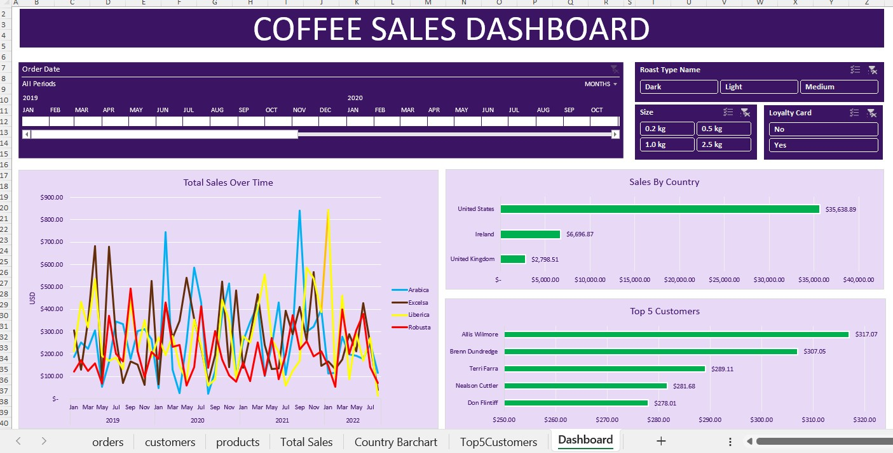

# ☕ Coffee Sales Data Analysis (Excel Project)

## 📌 Project Overview
This project analyzes coffee shop sales data using Microsoft Excel.  
The dataset includes relational tables (Orders, Customers, Products) which were transformed and modeled to create an interactive sales dashboard.

---

## 🗂 Dataset Structure

The project is structured as follows:
coffee-sales-excel-analysis/
data/ coffee_orders_raw_data.xlsx/ dashboard/
 coffee_sales_dashboard.xlsx/images/
 dashboard_preview.jpg

---

## 🧹 Data Preparation & Modeling

- Merged relational tables using lookup logic
- Created calculated column:
  - **Sales = Quantity × Unit Price**
- Built pivot tables for aggregation
- Created time-based analysis (Year/Month)
- Structured data into Excel tables

---

## 📊 Dashboard Features

- 📈 Total Sales Over Time
- 🌍 Sales by Country
- 👥 Top 5 Customers
- 🎛 Interactive Filters:
  - Roast Type
  - Size
  - Loyalty Card
  - Timeline (Date filter)

---

## 📈 Key Insights

- The United States generates the highest revenue.
- A small group of customers contributes significantly to total sales.
- Sales trends vary across coffee types and roast categories.

---

## 🛠 Tools Used

- Microsoft Excel
- Pivot Tables
- Lookup Functions
- Calculated Metrics
- Interactive Dashboard Design

---

## 📸 Dashboard Preview

